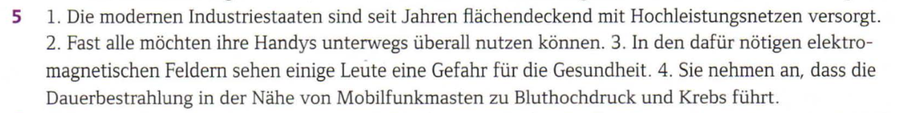
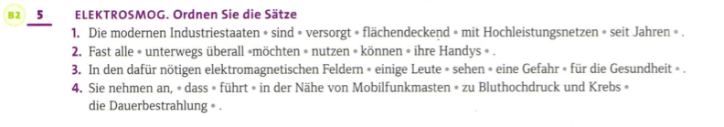
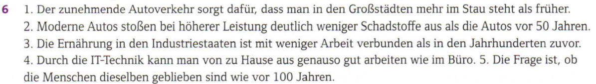
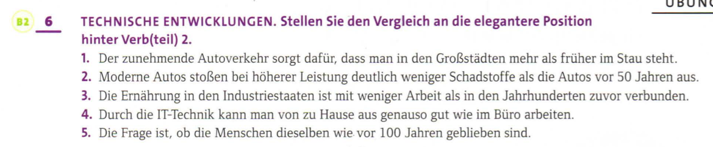

# Modul 1
<!-- Ich habe das Commit zu machen vergessen -->
## ÜB 5

    
Lösung

    </img>

</img>

1. Die modernen Industristaaten sind seit Jahren flächendeckend mit Hochleistungsnetzen versorgt.
2. Fast alle möchten ihre Handys unterwegs überall nutzen können.
3. In den dafür notigen elektromagnetischen Feldern sehen einige Leute eine Gefahr für die Gesundheit.
4. Sie nehmen an, dass die Dauerbestrahlung in der Nähe von Mobilfunkmasten zu Bluthochdruck und Krebs führt.

## ÜB 6

    
Lösung

    </img>

</img>

1. 